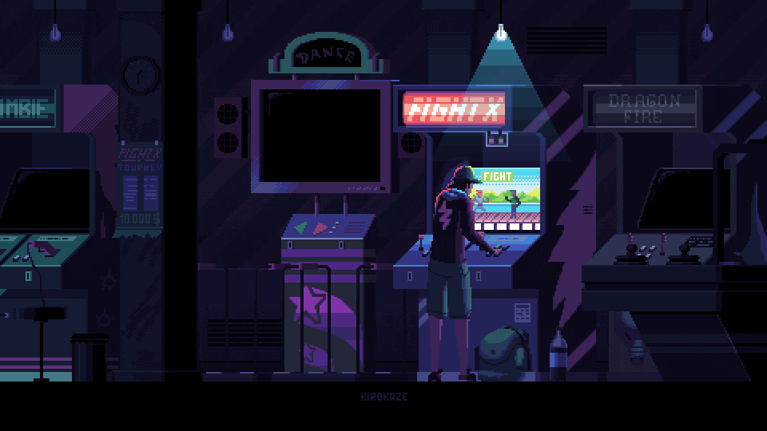

  

<h2 align="center">Hi 👋!  I'm Abrar Zahin Raihan.  Currently a sophomore studying CSE @ BUET</h2>

###

  
  
  

###

  <h1>Academic Coursework</h1>
  

<!-- ###

###

  
  
  
  
  
  
  
  
  
  
  
  
  
  
  
  
  
  
  
  
  
  
  
  
  
  
  
  
  
  
  
  
  
  
  
  
  
  
  
  
  
  
  
  
  
  
  
  
  
  
  
  
  
  
  
  
  
  
  
  
  
  
  
  
  
  
  
  
  
  
  
  
  
  
  

 -->

###

 <h1>Tech Stack</h1>

 <h3>Programming Languages</h3>
 
 
 
 
 
 
 
 
 
 
 
 
 
 
 

 <h3>Frontend Technologies</h3>
 
 
 
 
 
 
 
 
 <h3>Backend Frameworks</h3>
 
 
 
 
 
 
 
 
 
 
 <h3>Cloud & DevOps</h3>
 
 
 
 
 
 
 
 
 
 
 

 

 

 
 <h3>Databases</h3>
 
 
 
 
 
 
 <h3>Machine Learning & Data Science</h3>
 
 
 
 
 
 
 <h3>Development Tools</h3>
 
 
 
 
 
 
 
 
 <h3>Monitoring & Analytics</h3>
 
 
 
 
 <h3>Mobile Development</h3>
 
 
 <h3>Message Queue</h3>
 

###

###

 <h1>Socials</h1>

<!-- 

  
  
  
  
  

 -->

  <!-- Left-aligned image -->
  

    
  

  
  <!-- Right-aligned social media links -->
  

    
    
    
    
    
  

###

 

###
